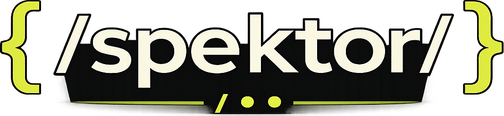

# Specter



Specter generates OpenAPI 3.0 documents and a browsable API console straight
from your Go source — no annotations, no code generation step, no runtime
reflection. It reads your routing code and handlers as an AST and infers paths,
parameters, request/response types, and status codes. It also documents gRPC
services from `.proto` files or generated `*.pb.go` stubs, and GraphQL schemas
from `.graphql` SDL or gqlgen-generated Go code.

```
go install github.com/user/specter/cmd/specter@latest
```

## Quick start (CLI)

```sh
# OpenAPI from the current package
specter -dir ./api -title "Users API" -version 1.0.0 -o openapi.json

# gRPC document from .proto or generated *.pb.go
specter -grpc -dir ./proto -o grpc.json

# GraphQL document from .graphql SDL or gqlgen-generated Go
specter -graphql -dir ./graph -o graphql.json
```

| Flag          | Description                                                |
| ------------- | ---------------------------------------------------------- |
| `-dir`        | Directory to scan (default `.`)                            |
| `-adapter`    | `gin`, `chi`, or `stdlib`; autodetected when empty         |
| `-title`      | API title (defaults to the directory name)                 |
| `-version`    | API version (default `0.1.0`)                              |
| `-grpc`       | Export the gRPC document instead of OpenAPI                |
| `-proto`      | Directory to scan for gRPC sources (defaults to `-dir`)    |
| `-graphql`    | Export the GraphQL document instead of OpenAPI             |
| `-graphqlDir` | Directory to scan for GraphQL sources (defaults to `-dir`) |
| `-o`          | Output file (defaults to stdout)                           |

## Embedded console (library)

`specter.Handler` serves the OpenAPI JSON, the gRPC JSON, the GraphQL JSON, a
gRPC invoke proxy, and a self-contained HTML console. Mount it on any router:

```go
ginui.Mount(r, specter.Config{Dir: ".", Title: "Users API", Version: "1.0.0"})
// GET /docs/                -> HTML console
// GET /docs/openapi.json    -> OpenAPI 3.0 document
// GET /docs/grpc.json       -> gRPC document
// GET /docs/graphql.json    -> GraphQL document
// POST /docs/grpc/invoke    -> gRPC call proxy
```

For non-gin routers, wrap `specter.Handler(cfg)` directly — it is a plain
`http.Handler`.

## Supported REST frameworks

| Framework      | Routes | Path params | Query | Header | Groups / versioning | Status codes |
| -------------- | :----: | :---------: | :---: | :----: | :-----------------: | :----------: |
| gin            |   ✅   |     ✅      |  ✅   |   ✅   |   `r.Group(...)`    |      ✅      |
| chi            |   ✅   |     ✅      |  ✅   |   ✅   |   `r.Route(...)`    |      ✅      |
| net/http (1.22)|   ✅   |     ✅      |  ✅   |   ✅   | sub-mux + `StripPrefix` | ✅      |

What Specter infers from handlers:

- **Request/response bodies** from `c.ShouldBindJSON`, `c.JSON`,
  `json.Decoder/Encoder`, `render.JSON`, etc., resolved to `$ref` schemas.
- **Query & header parameters** from `c.Query`, `c.GetHeader`,
  `r.URL.Query().Get`, `r.Header.Get`, `r.FormValue`.
- **Real status codes** from `c.JSON(201, ...)`, `w.WriteHeader(http.StatusNotFound)`,
  `c.Status(...)` — multiple responses per operation are supported.
- **Summaries & descriptions** from the handler's Go doc comment.

Struct schemas support enums (`type Status string` + typed consts), embedded
structs (composed via `allOf`), `time.Time`, maps, and slices.

## gRPC

Specter documents gRPC services two ways:

- **`.proto` sources** — services, methods, streaming, messages, and enum
  variant names.
- **Generated `*.pb.go` stubs** — reconstructed from `grpc.ServiceDesc` values
  and the server interfaces when the original protos are not available.

The console can invoke unary and server-streaming RPCs against a running target
(via server reflection or the local protos).

## GraphQL

Specter documents GraphQL schemas two ways:

- **`.graphql` / `.graphqls` SDL** — object, input, interface and enum types
  plus the fields on the `Query`, `Mutation`, and `Subscription` root types,
  with argument types and doc-string descriptions.
- **gqlgen-generated Go** — reconstructed from the `QueryResolver` /
  `MutationResolver` / `SubscriptionResolver` interfaces and the generated
  model structs when the original schema files are not available.

The console shows a GraphQL tab listing each root field with its arguments,
return type, and the referenced types.

## Architecture

```
specter.go            public API: Generate, GenerateGrpc, GenerateGraphql, Handler
cmd/specter           CLI
internal/core         OpenAPI/gRPC/GraphQL model + struct→schema scanner
internal/adapter/*    gin, chi, stdlib route scanners (shared logic in astutil)
internal/gen          routes + schemas -> OpenAPI document
internal/proto        .proto  -> gRPC document
internal/pbgo         *.pb.go -> gRPC document
internal/graphqlsdl   .graphql -> GraphQL document
internal/gqlgenx      gqlgen Go code -> GraphQL document
internal/grpcx        gRPC invoke proxy (grpcurl)
internal/ui, ginui    embedded HTML console + gin mount helper
```

## Limitations

- REST inference is AST-based; dynamically registered routes or params built
  from non-literal values are not detected.
- net/http grouping is limited to the sub-mux + `http.StripPrefix` idiom
  (the standard mux has no native groups).
- gRPC client-streaming and bidirectional RPCs are documented but not
  interactively invocable from the console.
- `.pb.go` enums surface as integers; `.proto` enums surface their names.
- GraphQL fields are documented but not invocable from the console; the Go
  fallback reports Go type names (and loses non-null/enum detail) since the
  SDL is not present to map them.
