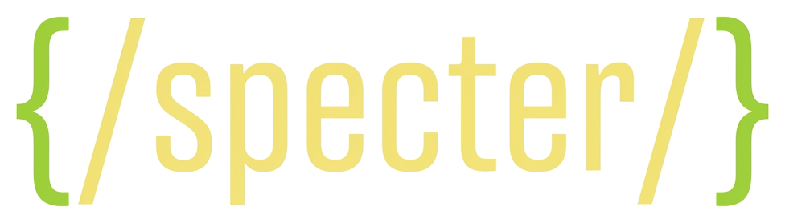

# Specter



Specter generates OpenAPI 3.0 documents and a browsable API console straight
from your Go source — no annotations, no code generation step, no runtime
reflection. It reads your routing code and handlers as an AST and infers paths,
parameters, request/response types, and status codes. It also documents gRPC
services from `.proto` files or generated `*.pb.go` stubs, and GraphQL schemas
from `.graphql` SDL or gqlgen-generated Go code.

```
go install github.com/bakhod1r/spector/cmd/specter@latest
```

Two features are behind build tags because they are the only reason the
install would be large. Everything described below is in the default build;
these two are not:

```sh
# Live gRPC calling from the console ("try it" on a gRPC method).
# Pulls grpcurl, grpc-go, protoreflect, go-spiffe and the envoy protos.
# Scanning .proto and writing grpc.json need none of this and are always built.
go install -tags grpclive github.com/bakhod1r/spector/cmd/specter@latest

# The MCP server (specter -mcp), for editor agents.
go install -tags mcp github.com/bakhod1r/spector/cmd/specter@latest

# Both
go install -tags "mcp grpclive" github.com/bakhod1r/spector/cmd/specter@latest
```

## Quick start (CLI)

```sh
# Every document a project has, in one command
specter -all -dir . -o ./specs

# OpenAPI from the current package
specter -dir ./api -title "Users API" -version 1.0.0 -o openapi.json

# gRPC document from .proto or generated *.pb.go
specter -grpc -dir ./proto -o grpc.json

# GraphQL document from .graphql SDL or gqlgen-generated Go
specter -graphql -dir ./graph -o graphql.json
```

| Flag          | Description                                                |
| ------------- | ---------------------------------------------------------- |
| `-dir`        | Directory to scan (default `.`)                            |
| `-config`     | Config file, JSON or YAML by extension (default: `specter.json`, `.yaml` or `.yml` in `-dir`, if present) |
| `-adapter`    | `gin`, `chi`, `echo`, `fiber`, `gorillamux`, `httprouter`, `bunrouter`, or `stdlib`; autodetected when empty |
| `-title`      | API title (defaults to the directory name)                 |
| `-version`    | API version (default `0.1.0`)                              |
| `-grpc`       | Export the gRPC document instead of OpenAPI                |
| `-proto`      | Directory to scan for gRPC sources (autodetected when empty) |
| `-gateway`    | Export a REST document built from `google.api.http` annotations in `.proto` sources (gRPC-Gateway) |
| `-graphql`    | Export the GraphQL document instead of OpenAPI             |
| `-graphqlDir` | Directory to scan for GraphQL sources (autodetected when empty) |
| `-o`          | Output file (defaults to stdout)                           |
| `-format`     | Document output format: `json` (default) or `yaml`; inferred from `-o`'s extension when empty |
| `-all`        | Write openapi.json, grpc.json and graphql.json into `-o` (a directory); `-format yaml` writes the `.yaml` names instead |
| `-lint`       | Report routing problems instead of a document; exits 1 if any |
| `-contract`   | Generate contract artefacts into this directory, e.g. `./contract` |
| `-contract-format` | Comma-separated: `http`, `go`, `curl` (default: all three) |
| `-contract-api` | Base URL the artefacts call (default: the document's first server) |
| `-contract-package` | Package name for the generated Go tests (default: the directory name) |
| `-evolve`     | Report how the API changed against a baseline, classified breaking/compatible/addition |
| `-since`      | Compare against a git revision, e.g. `HEAD~1` or `v1.0.0` |
| `-baseline-dir` | Compare against another source directory |
| `-baseline`   | Compare against an existing openapi.json |
| `-evolve-format` | `text` (default), `json`, or `markdown` |
| `-fail-on-breaking` | Exit non-zero if any breaking change is found (for CI) |
| `-proxy`      | Run a verifying proxy on an address, e.g. `:8080`, forwarding to `-proxy-target` |
| `-proxy-target` | The real API the proxy forwards to, e.g. `http://localhost:3000` |
| `-proxy-report` | Write a JSON drift report to this file on exit |
| `-proxy-record` | Record traffic to this file as JSONL; credentials redacted by default |
| `-proxy-record-raw` | Record **without** redacting — the file will contain secrets |
| `-proxy-learn` | Write an OpenAPI fragment for endpoints seen in traffic but not documented |
| `-proxy-merge` | With `-proxy-learn`, write the source document with observed traffic merged in (fills dynamic-route gaps) instead of a bare fragment |
| `-proxy-strict` | Exit non-zero if any drift was found (for CI) |
| `-merge-learned` | Merge a previously written observed fragment (`.json`) into the scanned document, filling routes the AST could not resolve |
| `-mock`       | Serve the document as a mock API on an address, e.g. `:8080` |
| `-mock-origin` | Comma-separated origins allowed to call the mock (default any) |
| `-mock-credentials` | Allow cookies and `Authorization` headers on mock requests |
| `-mock-max-age` | Seconds a browser may cache the mock's CORS preflight |
| `-postman`    | Export a Postman collection v2.1 (Insomnia imports it too) |
| `-postman-env` | Export a Postman environment (`baseUrl` and auth placeholders) instead of the collection |
| `-markdown`   | Export static Markdown API docs                            |
| `-har`        | Export a HAR 1.2 archive of example calls (one entry per operation) |
| `-asyncapi`   | Export an AsyncAPI 2.6 document of the WebSocket and SSE endpoints |
| `-sdk`        | Generate a typed client instead of a document: `go`, `ts`, `python`, `js`, `ruby`, `php`, `csharp`, `rust`, `kotlin`, `java` |
| `-sdk-out`    | Directory the client is written into (default `./sdk`)     |
| `-sdk-package` | Package name for the generated Go client (default `client`) |
| `-openapi`    | Generate the `-sdk` client from this OpenAPI file (`.json`/`.yaml`) instead of scanning source |
| `-watch`      | Stay running and regenerate whenever the scanned sources change |
| `-serve`      | Serve the interactive console on an address, e.g. `:8099`, until stopped |
| `-serve-mock` | With `-serve`, answer documented paths from the built-in mock on the console origin (shows a MOCK badge) |
| `-prod`       | Production mode: hide the scanned source (no file paths, line numbers, or **View source**) from the document and console |

### Client SDKs — ten languages

```sh
specter -dir ./api -sdk ts -sdk-out ./web/src/api
specter -dir ./api -sdk go -sdk-package usersapi -sdk-out ./client
specter -dir ./api -sdk python -sdk-out ./clients/py
```

A typed client in any of ten languages — **Go, TypeScript, Python, JavaScript,
Ruby, PHP, C#, Rust, Kotlin, Java** — all from the same document. Each is
dependency-light, using the language's own HTTP client and JSON: Go `net/http`,
TS/JS `fetch`, Python `urllib`, Ruby `net/http`, PHP ext-curl, C#
`HttpClient`+`System.Text.Json`, Rust `reqwest`+`serde`, Kotlin
`java.net.http`+`kotlinx.serialization`, Java `java.net.http` with a
dependency-free JSON runtime. Each schema becomes a type (`struct`, `class`,
`dataclass`, `data class`, record, …) and each operation a typed method, named
after its `operationId` when the document has one and after its method and path
otherwise. `allOf` composition is carried through — Go embeds the base type, TS
`extends` it, and the rest flatten its fields in — so a composed type never
silently loses the fields it inherits.

```ts
const api = new Client({ baseUrl: "https://api.example.com", token });
const users = await api.listUsers({ limit: 20 }); // User[]
```

```go
api := usersapi.New("https://api.example.com")
api.Token = token
users, err := api.ListUsers(ctx, nil) // []User
```

```python
api = Client("https://api.example.com", token=token)
users = api.list_users()  # list[User]
```

The output is source you own: commit it, edit it, and regenerate when the API
changes. It is not a framework to configure, and nothing imports specter at
runtime.

#### From an OpenAPI document

The client does not have to come from scanning source — point `-openapi` at an
existing `openapi.json` or `openapi.yaml` (a hand-written spec, or a third-party
API) and generate a client for it directly:

```sh
specter -openapi ./openapi.yaml -sdk rust -sdk-out ./clients/rust
```

### Watch mode

`-watch` keeps the command running and regenerates when a source file changes.
It combines with the modes that write files — `-o`, `-all`, `-sdk` — so a client
or a spec stays in step with the code while you edit it:

```sh
specter -dir ./api -o openapi.json -watch
specter -dir ./api -sdk ts -sdk-out ./web/src/api -watch
```

The tree is polled once a second and fingerprinted by name, size and mtime;
`.git`, `vendor` and `node_modules` are skipped. A regeneration that fails does
not end the watch — the next save may be the fix.

### `specter.json` / `specter.yaml`

Servers and security schemes are declared, not inferred, and a map of schemes
does not fit on a command line. Put them in a `specter.json` next to the code
and the CLI writes the same document the embedded console serves:

```json
{
  "title": "Shop API",
  "version": "1.2.0",
  "servers": [{ "url": "https://api.example.com", "description": "production" }],
  "security": {
    "bearerAuth": { "type": "http", "scheme": "bearer", "bearerFormat": "JWT" }
  },
  "basePath": "/docs",
  "accessKey": ""
}
```

The same settings can be written in YAML with identical keys — name the file
`specter.yaml` (or `specter.yml`):

```yaml
title: Shop API
version: 1.2.0
servers:
  - url: https://api.example.com
    description: production
security:
  bearerAuth: { type: http, scheme: bearer, bearerFormat: JWT }
basePath: /docs
```

### gRPC-Gateway (`google.api.http`)

```sh
specter -gateway -dir ./proto -o openapi.yaml
```

A service annotated for [gRPC-Gateway](https://github.com/grpc-ecosystem/grpc-gateway)
already declares its REST surface in the `.proto`. `-gateway` reads those
`google.api.http` options and writes the OpenAPI document the gateway actually
serves:

```proto
rpc GetUser(GetUserRequest) returns (User) {
  option (google.api.http) = {
    get: "/v1/users/{user_id}"
    additional_bindings { post: "/v1/users:get" body: "*" }
  };
}
```

- `get`/`put`/`post`/`delete`/`patch` and `custom { kind: ... path: ... }`
  become the operation's method and path; each `additional_bindings` entry
  becomes another operation.
- `{user_id}` becomes a required path parameter, typed from the request
  message's own field. The pattern in `{name=users/*}` is a gateway matching
  detail with no OpenAPI equivalent, so the parameter is `{name}`.
- `body: "*"` sends the whole request message; `body: "field"` sends that
  field's type. With no `body`, every request field the path did not consume
  becomes a query parameter — which is how the gateway reads them.
- A server-streaming RPC is marked `x-specter-realtime: stream`, because the
  gateway answers it with a stream of JSON messages rather than one body.
- An RPC **without** the annotation is gRPC-only and is left out: the document
  describes the HTTP surface, not every method on the service.

Servers, security, `-format` and manual route supplements apply exactly as they
do to a scanned REST document, so one config describes both front doors. The
library entry point is `specter.GenerateGateway(cfg)`.

### YAML output

```sh
specter -dir ./api -o openapi.yaml          # extension picks YAML
specter -dir ./api -format yaml             # or say so explicitly
specter -grpc -dir ./proto -format yaml
```

The document is JSON by default. `-format yaml` emits the same document as
YAML, and an `-o` ending in `.yaml`/`.yml` implies it, so an output file never
holds JSON under a YAML name; an explicit `-format` always wins over the
extension. Key order is the document's own — `openapi`, `info`, `paths`, … —
not alphabetical, so the spec reads top-down the way the JSON does. It applies
to the OpenAPI, gRPC and GraphQL documents, including `-all`. Postman, HAR and
AsyncAPI are formats of their own and are unaffected.

### Manual route supplements

A route the AST genuinely cannot resolve — built in a loop, from a slice, or
returned by a function — is reported as a diagnostic and documented nowhere.
Declare it by hand in the config file's `routes:` list and it joins the
document, marked `x-specter-manual` so a reader can tell an asserted route from
a scanned one:

```yaml
routes:
  - method: GET                  # default GET
    path: /v1/reports/{id}       # required, leading / required
    summary: Report by id
    description: Generated nightly.
    operationId: getReport
    tags: [reports]
    deprecated: false
    responses: ["200", "404"]    # default ["200"]
    fills: routes.go:42          # the diagnostic this answers
```

The scan always wins: a supplement adds a route or a status code the source did
not document, and never rewrites one it did. `fills` names the `file.go:line`
the diagnostic reported; when it matches, that diagnostic is dropped, so a
fully supplemented codebase passes `-strict-routes`. A `fills` that matches
nothing leaves every diagnostic in place rather than silencing the wrong one.
Library callers pass the same entries as `Config.Routes` (`[]specter.ManualRoute`).

It is picked up automatically when it sits in `-dir` — `specter.json` is tried
first, then `specter.yaml`, then `specter.yml`, and the first found wins.
`-config` names one elsewhere, its format chosen by extension (`.yaml`/`.yml` is
YAML, otherwise JSON). The file is a default, not an override — a flag you
actually typed wins. A `-config` that does not exist, or a file that does not
parse, is an error rather than a silent fallback.

## Embedded console (library)

Specter is meant to be added to a service you already have: import it, mount
it on the router you already built, and the console documents whatever that
service serves. There is no build step and nothing to keep in sync — the
document is derived from the source at startup.

```go
import (
    "github.com/bakhod1r/spector"
    "github.com/bakhod1r/spector/mount"
)

func main() {
    r := gin.Default()
    registerYourRoutes(r)          // the service you already have

    mount.Gin(r, specter.Config{
        Dir:       ".",            // where to read the routing code
        Title:     "Users API",
        Version:   "1.0.0",
        BasePath:  "/docs",        // where to mount it; "/docs" is the default
        AccessKey: cfg.SpecterKey, // your app decides where this comes from
    })

    r.Run(":8080")                 // one server, yours
}
```

**Specter never listens on anything.** The `mount` functions register routes on the router
you pass it, and `specter.Handler` is a plain `http.Handler` — there is no
second port to open, no goroutine started, and no separate process. The console
is served by your server, behind your middleware and your TLS, and it goes away
when your server does.

With the mount above:

```
GET  /docs/                -> HTML console
GET  /docs/openapi.json    -> OpenAPI 3.0 document
GET  /docs/grpc.json       -> gRPC document
GET  /docs/graphql.json    -> GraphQL document
POST /docs/grpc/invoke     -> gRPC call proxy
```

Set `BasePath` to move the whole set: `BasePath: "/internal/api-docs"` serves
the console at `/internal/api-docs/` and the spec at
`/internal/api-docs/openapi.json`.

### Other routers

`mount` has one function per framework, all with the same signature and the
same behaviour:

```go
mount.Gin(r, cfg)      // gin.IRouter
mount.Echo(e, cfg)     // *echo.Echo
mount.Chi(r, cfg)      // chi.Router
mount.Stdlib(mux, cfg) // *http.ServeMux
mount.Fiber(app, cfg)  // fiber.Router
mount.GorillaMux(r, cfg) // *mux.Router
```

Importing `mount` compiles all six frameworks into your binary. If that
matters, skip the package: `specter.Handler(cfg)` is a plain `http.Handler`,
and mounting it by hand is two lines.

```go
mux.Handle("/docs/", http.StripPrefix("/docs", specter.Handler(cfg)))
```

The root `specter` package does not import `mount`, so this path costs no
framework dependencies at all.

Fiber is the one with a caveat: it runs on fasthttp, so each request crosses an
adaptor that rebuilds it as an `*http.Request`. Fine for a console, worth
knowing before you put it on a hot path.

Everything Specter needs arrives through `Config`. The library reads no
environment variables and no config files of its own, so where a value comes
from — env, a secret manager, a flag, a config struct — stays your
application's decision.

## Source links

Specter reads the AST, so it knows the file and line every operation came from.
Each operation carries it as a vendor extension:

```json
"get": {
  "operationId": "listCarts",
  "x-specter-source": { "file": "main.go", "line": 463 }
}
```

In the console each operation has a **View source** button that shows the
handler with the registering line highlighted. The code is fetched on demand
from `GET <base>/source?file=…&line=…` rather than embedded in the spec, which
would inflate a document served to every visitor for a panel most readers never
open.

`file` is relative to the scanned directory. Absolute paths would differ per
machine and leak the developer's home directory into a committed artifact.

This is the one endpoint that reads files for a request, so it is deliberately
narrow: `.go` files only, resolved and then checked to be inside the scanned
directory — symlinks included, since a "reject `..`" filter does not see them —
and it sits behind `AccessKey` like everything else. Failures answer 404 without
saying why, so a caller cannot use the response to map what exists outside the
tree.

The snippet comes from the running server's filesystem. A binary deployed
without its sources still documents fine; the panel just reports that the code
is not available there.

## Validation constraints

The struct scanner reads `binding:"..."` (gin) and `validate:"..."`
(go-playground/validator) alongside `json:"..."`, and turns the rules that have
a JSON Schema equivalent into real constraints:

```go
type CreateCartReq struct {
    UserID int        `json:"userId" binding:"required,gte=1"`
    Email  string     `json:"email"  binding:"required,email"`
    Note   string     `json:"note"   binding:"max=200"`
    Tier   string     `json:"tier"   binding:"oneof=free pro enterprise"`
    Items  []LineItem `json:"items"  binding:"required,min=1,max=50"`
}
```

```json
"userId": { "type": "integer", "minimum": 1 },
"email":  { "type": "string", "format": "email" },
"note":   { "type": "string", "maxLength": 200 },
"tier":   { "type": "string", "enum": ["free", "pro", "enterprise"] },
"items":  { "type": "array", "minItems": 1, "maxItems": 50 },
"required": ["userId", "email", "items"]
```

`min` and `max` mean three different things depending on the field: a value
bound on a number, a length on a string, a count on an array. That is why
constraints are applied after the type is resolved.

Rules with no JSON Schema equivalent — `gtfield`, `required_with`, `contains`,
custom validators — are ignored in silence, and so is a malformed tag. A typo in
a struct tag is not a reason to stop documenting an API.

Specter does not validate anything at runtime. It never sits in the request
path; it only reads the source.

## Standards advice

Specter reviews the generated document against the HTTP and JSON standards and
reports where an API diverges, in the console next to each operation:

```json
"x-specter-advice": [{
  "rule": "rfc9457-content-type",
  "severity": "should",
  "message": "404 returns application/json; error responses should use application/problem+json …",
  "reference": "RFC 9457 (Problem Details for HTTP APIs)"
}]
```

Current rules:

| Rule | Standard | What it says |
| ---- | -------- | ------------ |
| `rfc9457-content-type` | RFC 9457 | Error bodies should be `application/problem+json` |
| `rfc9457-fields` | RFC 9457 | A near-problem document is missing `type`/`instance`/… |
| `no-error-response` | RFC 9110 | No failure response is documented at all |
| `post-created` | RFC 9110 | A creating POST should answer 201 with `Location` |
| `delete-no-content` | RFC 9110 | An empty 200 on DELETE is better as 204 |

**These are recommendations, never rewrites.** Specter documents what the code
does. Reshaping an error body in the document to match RFC 9457 would make it
describe an aspiration instead of a service, so the advice is attached and the
decision stays yours.

Every entry cites the standard it comes from — a recommendation without a
citation is just an assertion — and an API that already conforms is left alone,
because a linter that fires on correct code teaches people to ignore it.

## Dependency map

Reading the AST also shows what a handler reaches: a database, another service,
a cache, a queue. Each operation carries what was found, and the console shows
it as a row of chips.

```json
"x-specter-calls": [
  { "kind": "db",    "target": "db.ExecContext",      "confidence": "likely" },
  { "kind": "http",  "target": "http.Post",           "confidence": "certain" },
  { "kind": "queue", "target": "writer.WriteMessages","confidence": "likely" }
]
```

Handlers usually delegate, so calls are followed up to three levels down —
handler → service → repository — which is where the query normally lives.

**Read the confidence.** Specter has no type checker, so there are two ways a
call gets identified, and they are not equally trustworthy:

- `certain` — the call went through an imported package (`http.Post`,
  `sql.Open`). The import statement proves what it is.
- `likely` — it was matched on the receiver's name (`db.Query`, `cache.Get`).
  That is a convention, and conventions are sometimes wrong.

The console draws `likely` chips with a dashed border and says why. A
dependency map that presents guesses as facts is worse than no map, because it
gets believed.

Calls that cannot be classified are not reported. Listing every method call in a
handler would bury the few that matter, and a handler that reaches nothing shows
nothing — silence has to be reportable for the map to mean anything.

`examples/deps` is a small service with real dependencies; `examples/shop` is
in-memory on purpose and correctly shows none.

## Contract artefacts

A generated document is a claim, and until something executes it, nothing checks
it. The service moves, the document does not, and they drift apart quietly —
which is what makes a stale document worse than none: it is believed.

`-contract` writes three artefacts that call the API and compare it against its
own document:

```sh
specter -contract ./contract -dir ./api
```

| File | What it is for |
| ---- | -------------- |
| `requests.http` | Every endpoint as a runnable request, for VS Code's REST Client or the JetBrains HTTP client. Open, click Send. |
| `contract_test.go` + `check.go` | The same requests as Go tests, for CI. Behind a `contract` build tag, so `go test ./...` is unaffected. |
| `smoke.sh` | Status codes only, in POSIX shell — for a pipeline that has curl and nothing else. |

```sh
SPECTER_BASE_URL=http://localhost:8080 go test -tags contract ./contract
SPECTER_BASE_URL=http://localhost:8080 sh contract/smoke.sh
```

Requests are runnable as written: path parameters are filled, required query and
header parameters are sent, and request bodies are sampled from the schema, so
they satisfy the document rather than needing to be edited first. Optional
parameters are left out — a guessed value makes a call fail for a reason that is
not the contract.

What the Go tests assert:

- **Status** is one of the documented codes. All of them count: a 404 the
  document promises is the endpoint behaving, not failing.
- **Content-Type** is JSON where a JSON body was documented.
- **Shape** — required properties are present, types match, enum values are in
  range. A property the response carries and the document does not is reported
  and passes: the API growing past its document is worth knowing, but it is not
  a broken contract.

Failures name both sides, because which one is wrong is a judgement call:

```
GET /users: response.items[0].price: documented as a number, got a string
```

Flags: `-contract-format` selects `http,go,curl`; `-contract-api` sets the base
URL (default: the document's first server); `-contract-package` names the Go
package (default: the directory name).

The output is source — the first version is free and every version after it is
yours.

## API evolution

A version number is meant to encode one thing — is this safe to upgrade to? — and
almost never actually does. Specter answers it from the two documents rather than
from a changelog someone remembered to write:

```sh
specter -dir ./api -evolve -since HEAD~1
```

Every difference is classified by what it does to a client already using the API,
which is the only classification that matters at a release boundary:

- **breaking** — an existing, working client stops working: an endpoint or status
  removed, a response field gone or no longer guaranteed, a newly required
  parameter or request field, a narrowed type or enum.
- **compatible** — safe to adopt but worth recording: a new optional parameter, a
  relaxed requirement, a newly documented status, an added response field.
- **addition** — pure new surface; nothing existing is touched.

Request and response are judged in opposite directions, because they are: a client
*sends* requests and *receives* responses, so tightening a request (a new required
field) and tightening a response (a removed field) are both breaking while looking
like opposite edits.

The baseline comes from a git revision (`-since HEAD~1`, `-since v1.0.0`), another
directory (`-baseline-dir`), or an existing document (`-baseline old.json`). A
revision is exported with `git archive` into a temp directory and scanned — the
working tree, the index, and any uncommitted work are never touched. Both sides go
through the same scanner, so a change in how Specter reads code never masquerades
as an API change.

```sh
specter -dir ./api -evolve -since v1.0.0 -evolve-format markdown  # a changelog section
specter -dir ./api -evolve -since HEAD~1 -fail-on-breaking        # a CI gate
```

`-evolve-format json` emits a stable-ordered, machine-readable diff; `-fail-on-breaking`
turns any breaking change into a non-zero exit, so a pipeline stops before a
breaking change ships.

## Verifying proxy

The contract artefacts check the document with requests Specter invented: one
sample body, one path value, the happy path. Real traffic is not like that. It
has empty lists, error cases, clients sending fields nobody documented, and
endpoints the scanner never saw because they are registered somewhere it does
not read. Those are exactly the places a document goes stale.

The proxy sits in front of the real API, forwards everything untouched, and
reports where the traffic disagrees with the document:

```sh
specter -dir ./api -proxy :8080 -proxy-target http://localhost:3000
```

Point your clients (or your test suite) at `:8080` instead of the API, and every
request is checked as it passes through. It is a watcher, not a gate — a finding
never costs a request its response, and analysis happens after the client
already has its answer.

What it reports, each aggregated with a count so a busy endpoint is one line and
not a thousand:

- **undocumented-endpoint** — traffic to an operation the document does not have.
- **undocumented-status** — a documented endpoint answering with a code its
  document does not list; the one code a generated client will not handle.
- **content-type** — a body arriving as something other than the promised media type.
- **shape** — a response contradicting its schema (missing required field, wrong
  type, out-of-range enum). This is the *same check* the generated contract tests
  run, from one shared source, so the two can never disagree about a response.
- **undocumented-field** — a property the response carries and the document does
  not. Reported, never fatal: the API grew, nothing broke.

`-proxy-report drift.json` writes a stable-ordered report for CI to diff, and
`-proxy-strict` makes any drift a non-zero exit.

### Learning what the scanner missed

Static analysis cannot see a route registered through a table or served by a
library, but those endpoints walk past the proxy every day. `-proxy-learn
observed.json` writes an OpenAPI fragment for the traffic that matched no
documented endpoint — with identifier segments collapsed (`/users/42` →
`/users/{id}`) and response schemas inferred from the bodies seen. It is
evidence, not a specification, and is marked for review rather than blind merge.

### ⚠️ Recording traffic

`-proxy-record traffic.jsonl` writes every exchange to a file. **A recording
proxy captures whatever passes through it** — on a real API that means bearer
tokens, session cookies, API keys, passwords in login bodies, and personal data.
A recording is a credential store and a PII store.

So the safe behaviour is the default: credential headers (`Authorization`,
`Cookie`, `Set-Cookie`, and any header named like a key/token/secret) are
redacted, body fields with sensitive-looking names (`password`, `apiKey`,
`secret`, …) are masked, and the file is written `0600`. Field-name masking is
not a guarantee — a field called `ssn` is personal data no name list catches.

**Do not point the recorder at production traffic containing real user data
unless you intend to handle the output as sensitive data**, and do not commit a
recording. `-proxy-record-raw` disables all redaction; it exists for debugging a
local API and its help text says what it does.

## Mock server

A frontend does not have to wait for the backend:

```sh
specter -mock :8080 -dir ./api
```

Every documented path answers with a body that satisfies its own response
schema — enums, formats, bounds and lengths included, because a mock that
returns data its own document would reject is worse than none: the client
passes locally and fails against the real API, which is the exact failure a
mock exists to prevent.

```sh
curl localhost:8080/api/v1/carts/42
# { "id": 42, "items": [...], "subtotal": { "amount": 1.5, ... } }
```

Path parameters are echoed back, so `GET /users/42` answers with id 42 rather
than a fabricated one — the only realism available without inventing state.

Force any documented status to exercise error handling:

```sh
curl "localhost:8080/api/v1/carts/42?__status=404"
```

An undocumented status is refused rather than ignored, so a client cannot
believe it tested a path the API cannot produce.

**The mock is a separate process on its own port**, and it is not mountable on
your router. That is deliberate: the point at which a mock is useful is the
point at which the backend does not exist yet, so there is no router to mount
it on. It also keeps code that fabricates responses out of the request path of
a real service entirely — no flag, no header, and no configuration that could
turn a production route into a source of invented data.

### CORS

A separate port means a separate origin, so every browser call to the mock is a
cross-origin request. By default it is open to anyone, which is right for a mock
whose caller runs on whatever port the dev server picked today:

```sh
specter -mock :8080 -dir ./api
```

Restrict it, or allow credentials, when the default does not fit:

```sh
specter -mock :8080 -dir ./api \
  -mock-origin http://localhost:5173,http://localhost:3000 \
  -mock-credentials
```

**Credentials change how the origin is answered, and that is not optional.** The
CORS specification forbids pairing `Access-Control-Allow-Origin: *` with
credentials — browsers reject it outright — so with `-mock-credentials` the
caller's own origin is echoed back instead of a wildcard. That is safe here and
only here: the mock serves fabricated data and has no session behind it. The
same trick on a real API would be a vulnerability.

An origin that is not allowed receives no CORS headers at all, which is what
makes the browser block it. The request is still answered, because CORS is
enforced by the browser and refusing it server-side would give a misleading
picture of how the real API behaves.

`Vary: Origin` is sent whenever the response depends on the caller's origin, so
a cache cannot hand one origin's response to another.

As a library:

```go
doc, _ := specter.Generate(cfg)
specter.ServeMock(":8080", doc, specter.MockOptions{
    AllowOrigins:     []string{"http://localhost:5173"},
    AllowCredentials: true,
    MaxAge:           600,
})
```

**It is shape, not state.** Two GETs return the same body, and a POST does not
change what a later GET returns. Making it stateful would mean guessing at
semantics the document does not describe, and a mock that is subtly wrong about
behaviour is worse than one that is obviously only about shape.

## Postman and Insomnia

Export the scanned API as a Postman collection v2.1 (Insomnia imports the same
format):

```sh
specter -postman -dir . -o api.postman_collection.json
specter -postman-env -dir . -o api.postman_environment.json
```

The collection imports ready to run:

- **The base URL is a `{{baseUrl}}` variable**, seeded from the document's first
  server and carried in the collection's own variable block, so it imports with
  a working default and points elsewhere by editing one value.
- **`-postman-env` writes a matching environment** — `baseUrl` plus a
  placeholder per auth scheme, credentials typed `secret` so Postman masks them.
  Import the collection once, then switch environments to hit dev, staging or
  prod.
- **Each request carries a test script** asserting the response status is one
  the document declares, and that the body parses when the operation documents a
  JSON response — so `newman run` is a live contract check, not just a smoke test.
- **Documented responses become saved examples** with a body sampled from the
  response schema, so every request ships with a realistic sample to read.
- Path parameters render as editable `:id` variables, optional query parameters
  import disabled, and one representable security scheme becomes collection-level
  auth.

### HAR archive

Export the API as a [HAR 1.2](http://www.softwareishard.com/blog/har-12-spec/)
archive — the log format browsers, proxies and load tools read:

```sh
specter -har -dir . -o api.har
```

Each operation becomes one entry with a request body sampled from its schema and
a response seeded from the lowest documented status, so the archive replays as a
realistic set of example calls. URLs are absolute against the first server, or
relative when the document names none.

## Linting routes

Three routing mistakes compile cleanly, start cleanly, and fail silently:

```sh
specter -lint -dir ./api
```

```
main.go:88:  duplicate-route: GET /users is registered more than once; one registration will never run
main.go:142: orphan-handler: deleteUser looks like a handler but no route registers it
main.go:97:  shadowed-route: GET /users/me may be shadowed by /users/{id} registered earlier at main.go:94
```

- **orphan-handler** — a function shaped like a handler that no route
  registers. Usually a renamed function or a deleted registration: the code
  still builds and the endpoint quietly stops existing.
- **duplicate-route** — the same method and path registered twice. One of them
  never runs.
- **shadowed-route** — a literal path registered after a parameterised one that
  matches it, so `/users/me` may be answered by the `/users/{id}` handler.

It exits 1 when it finds anything, so CI can gate on it:

```yaml
- run: go run github.com/bakhod1r/spector/cmd/specter -lint -dir ./api
```

Handlers are recognised by signature rather than by name, so ordinary helpers
are not flagged. Shadowing is reported for every framework, not only the ones
that resolve it by registration order — a reader of the code cannot tell which
handler serves `/users/me` without knowing the router's matching rules, and
that ambiguity is worth removing either way.

## Supported REST frameworks

| Framework      | Routes | Path params | Query | Header | Groups / versioning | Status codes | Middleware |
| -------------- | :----: | :---------: | :---: | :----: | :-----------------: | :----------: | :--------: |
| gin            |   ✅   |     ✅      |  ✅   |   ✅   |   `r.Group(...)`    |      ✅      |     ✅     |
| chi            |   ✅   |     ✅      |  ✅   |   ✅   |   `r.Route(...)`    |      ✅      |     ✅     |
| echo           |   ✅   |     ✅      |  ✅   |   ✅   |   `e.Group(...)`    |      ✅      |     ✅     |
| fiber          |   ✅   |     ✅      |  ✅   |   ✅   |  `app.Group(...)`   |      ✅      |     ✅     |
| gorilla/mux    |   ✅   |     ✅      |  ✅   |   ✅   | `PathPrefix(...).Subrouter()` | ✅ |    ✅     |
| net/http (1.22)|   ✅   |     ✅      |  ✅   |   ✅   | sub-mux + `StripPrefix` | ✅      |     ✅     |
| httprouter     |   ✅   |     ✅      |  ✅   |   ✅   |        —            |      ✅      |     —      |
| bunrouter      |   ✅   |     ✅      |  ✅   |   ✅   | `WithGroup(...)`   |      ✅      |     —      |

What Specter infers from handlers:

- **Request/response bodies** from `c.ShouldBindJSON`, `c.Bind`, `c.BodyParser`,
  `c.JSON`, `json.Decoder/Encoder`, `render.JSON`, etc., resolved to `$ref`
  schemas.
- **Query & header parameters** from `c.Query`, `c.QueryParam`, `c.GetHeader`,
  `r.URL.Query().Get`, `r.Header.Get`, `r.FormValue`.
- **Real status codes** from `c.JSON(201, ...)`, `w.WriteHeader(http.StatusNotFound)`,
  `c.Status(...)`, `c.NoContent(...)`, `c.SendStatus(...)`, and fiber's
  `c.Status(201).JSON(...)` chain — multiple responses per operation are
  supported, and the primary response type is taken from the first 2xx rather
  than whichever body the handler happened to write first.
- **Summaries & descriptions** from the handler's Go doc comment.

Struct schemas support enums (`type Status string` + typed consts), embedded
structs (composed via `allOf`), `time.Time`, maps, and slices.

## gRPC

Specter documents gRPC services two ways:

- **`.proto` sources** — services, methods, streaming, messages, and enum
  variant names.
- **Generated `*.pb.go` stubs** — reconstructed from `grpc.ServiceDesc` values
  and the server interfaces when the original protos are not available.

The console can invoke gRPC methods interactively against a running target (via
server reflection or the local protos), over a WebSocket. Unary and
server-streaming methods send a single request and stream responses back live.
Client-streaming and bidirectional methods support sending multiple messages
on the same call, with an explicit Half-close to signal the end of the request
stream, plus Cancel to abort the call.

## GraphQL

Specter documents GraphQL schemas two ways:

- **`.graphql` / `.graphqls` SDL** — object, input, interface and enum types
  plus the fields on the `Query`, `Mutation`, and `Subscription` root types,
  with argument types and doc-string descriptions.
- **gqlgen-generated Go** — reconstructed from the `QueryResolver` /
  `MutationResolver` / `SubscriptionResolver` interfaces and the generated
  model structs when the original schema files are not available.

The console shows a GraphQL tab listing each root field with its arguments,
return type, and the referenced types.

## Servers and security

Which hosts serve the API cannot be read from source, and the exact shape of a
security scheme — where the token goes, what format it is in — is a detail no
middleware name reveals. Declare them:

```go
specter.Config{
    Dir: ".",
    Servers: []specter.Server{
        {URL: "https://api.example.com", Description: "production"},
        {URL: "http://localhost:8080"},
    },
    Security: map[string]specter.SecurityScheme{
        "bearerAuth": {Type: "http", Scheme: "bearer", BearerFormat: "JWT"},
        "apiKeyAuth": {Type: "apiKey", Name: "X-API-Key", In: "header"},
    },
}
```

These land in `servers`, `components.securitySchemes`, and a document-level
`security` block. Multiple schemes are listed as alternatives — any one
satisfies a request. A declared scheme always beats an inferred one.

Schemes are emitted in name order, so regenerating produces a byte-identical
document rather than churn in review.

### Which routes are protected

That part *is* read from source. Authentication almost never appears in the
handler — it runs in middleware on the router — so a generator that reads only
handler bodies documents every endpoint as public, including the ones that
answer 401 to everybody.

Specter follows the middleware instead, per route and in order:

| Router     | How middleware is found                                        |
| ---------- | -------------------------------------------------------------- |
| gin        | `r.Use(...)`, `r.Group(path, mw...)`, `r.GET(path, mw..., h)`   |
| echo       | `e.Use(...)`, `e.Group(path, mw...)`, `e.GET(path, h, mw...)`   |
| chi        | `r.Use(...)`, `r.Route`/`r.Group` closures, `r.With(mw).Get(...)` |
| net/http   | wrapping: `mw(handler)`, a wrapped mounted sub-mux, and the wrapper around the server's own handler |

Position decides: `r.Use(x)` applies to what is registered after it, and a
guard on one group never reaches its siblings.

The middleware's *name* is a convention, so what it produces is reported as a
guess — `JWTAuth`, `RequireAPIKey`, `CORS`, `RateLimiter` are recognised. Its
*body* is evidence, and overrides the guess: the headers it reads become
required parameters, and the statuses it rejects with (`c.AbortWithStatus`,
`http.Error`, `echo.NewHTTPError`, a `WriteHeader` followed by `return`) become
documented responses. That is what makes a `TenantGuard` or `SignMiddleware` —
names no pattern list could know — documentable at all.

## Gating the console

By default the console is served to anyone who can reach the route. Set an
access key to require a shared secret:

```go
mount.Gin(r, specter.Config{
    Dir:       ".",
    AccessKey: cfg.SpecterKey,   // empty = open, the default
})
```

The key is a plain `Config` field: Specter never reads it from the environment
itself, so it fits whatever your service already uses for secrets.

Open it once with the key in the URL — `/docs/?key=<value>` — and the key is
stored in an `HttpOnly` cookie so the page's own requests carry it. Scripts and
CI can send `X-Specter-Key` instead. Without a valid key every route under the
handler answers 404, including `grpc/invoke`.

**This is a deployment gate, not authentication.** There are no accounts, no
expiry, and no revocation short of changing the value and restarting. Everyone
who holds the key has full access, and the console can invoke your gRPC
methods, so treat it the way you would treat a database password: keep it out
of source, and put a real authenticating proxy in front of anything that needs
per-user access.

## Realtime

The console's Realtime tab connects to three transports from the browser. It
is a client only — Specter does not infer these endpoints from your code, you
type the URL.

- **WebSocket** — connect, watch inbound frames, send payloads.
- **SSE** — `EventSource`. It is GET-only and cannot carry custom headers, so
  auth has to ride in the query string. Named events reach only matching
  listeners, so the pane asks which names to subscribe to.
- **MQTT** — over `ws://`, using a small hand-written MQTT 3.1.1 codec, since
  Specter ships as one file with no external assets. Browsers cannot open raw
  TCP, so the broker needs a WebSocket listener (Mosquitto: `listener 9001` +
  `protocol websockets`).

`examples/shop` serves `/events` and `/ws` so the tab has something to talk to.

### AsyncAPI export

The scanner already recognises WebSocket and SSE handlers — an upgrade call or
an `text/event-stream` content type — and marks the operation. OpenAPI has no
vocabulary for these channels, so `-asyncapi` exports them as an
[AsyncAPI 2.6](https://www.asyncapi.com/) document instead:

```sh
specter -asyncapi -dir . -o asyncapi.json
```

Each realtime endpoint becomes a channel keyed by its path. A WebSocket is
bidirectional, so it carries both `subscribe` and `publish` operations with a
`ws` binding; SSE streams server-to-client only, so it carries `subscribe`
alone. The message payload comes from the handler's first documented JSON
response, and the referenced schemas are carried into `components` so the
`$ref`s resolve. Server protocols are inferred from the URL scheme (`https` →
`wss`). Ordinary REST operations stay in the OpenAPI document.

## Architecture

```
specter.go            public API: Generate, GenerateGrpc, GenerateGraphql, Handler
cmd/specter           CLI
internal/core         OpenAPI/gRPC/GraphQL model + struct→schema scanner
internal/adapter/*    gin, chi, echo, fiber, gorillamux, stdlib route scanners
                      (shared handler analysis in astutil)
internal/gen          routes + schemas -> OpenAPI document
internal/sdk          OpenAPI document -> TypeScript / Go client source
internal/proto        .proto  -> gRPC document
internal/pbgo         *.pb.go -> gRPC document
internal/graphqlsdl   .graphql -> GraphQL document
internal/gqlgenx      gqlgen Go code -> GraphQL document
internal/grpcx        gRPC invoke proxy (grpcurl)
internal/contract     document -> .http, Go contract tests, smoke.sh
internal/conform      shared response-vs-schema checker (contract + proxy)
internal/route        request -> documented operation matcher (mock + proxy)
internal/proxy        verifying reverse proxy: drift, record, learn
internal/evolve       two documents -> breaking/compatible/addition changes
internal/ui           embedded HTML console (single file, no assets)
mount                 gin/echo/chi/stdlib/fiber/gorillamux mount helpers
```

The console's realtime clients (WebSocket, SSE, and the MQTT codec) live in
`internal/ui/ui.html` alongside the rest of the page.

## Testing

```sh
go test ./...          # unit + integration
go test -race ./...    # what CI runs
```

The console's stateful behaviour — export/import, Execute, routing, and the
realtime panes — cannot be reached from Go tests, so it has a browser suite:

```sh
cd e2e
npm install && npx playwright install chromium
mosquitto -c mosquitto.conf -d    # optional; the MQTT suite skips without it
npm test
```

`npm test` builds and starts `examples/shop` itself on a free port. That is
deliberate: pointing the suite at an already-running server makes it easy to
test a stale binary and believe the result.

The MQTT pane is checked against Mosquitto rather than a stub. The client
codec is hand-written, so an independent broker is the only thing that
catches a misreading of the protocol.

## Limitations

- REST inference is AST-based. Route paths and group prefixes built from
  package-level string constants/vars, function-local `:=` short variables,
  and `+` concatenations of those resolve just like literals. Resolution is
  scope-aware: a function-local variable that shadows a same-named
  package-level const/var resolves to the local value, not the package one.
  If a local variable cannot be resolved statically, it is not silently
  filled in from a same-named package const — it is reported to stderr as a
  dynamic-route diagnostic, same as any other unresolved path. A path that is
  genuinely dynamic — built in a loop, from a slice/map, from a function
  return, or from a parameter — is likewise reported to stderr as a
  diagnostic instead of silently dropped. Pass `-strict-routes` to turn any
  such diagnostic into a non-zero exit, for CI, and declare the route by hand
  in the config file's `routes:` list to document it anyway.
- net/http grouping uses the sub-mux + `http.StripPrefix` idiom, and sub-muxes
  nest: a mux mounted on a mux mounted on the root composes every prefix and
  guard onto the leaf routes (the standard mux has no native groups).
- `.pb.go` enums surface their names, read from the generated `Xxx_name` map;
  `.proto` enums surface their names directly.
- The Go (gqlgen) GraphQL fallback infers non-null from pointer-ness (a value is
  non-null, a pointer nullable) and reads enum values from typed consts, so
  `[]*User` reads `[User]!` and a `Role` string enum surfaces its members.
  Reading the `.graphql` SDL directly is still more precise for detail Go cannot
  carry, such as custom scalar names and directives.
